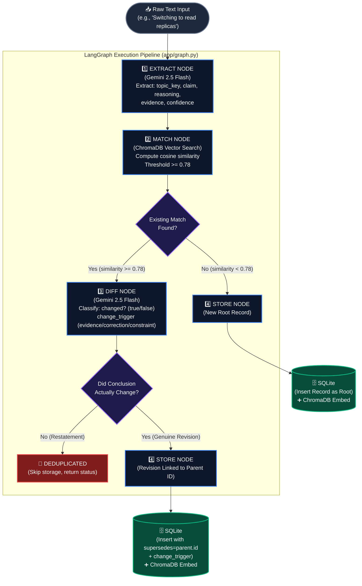

# System Architecture — Decision Provenance Agent

> **"Not just 'what happened' — 'why we changed our minds,' as a first-class, queryable object."**

---

## 1. High-Level System Architecture Blueprint

```
┌──────────────────────────────────────────────────────────────────────────────────────────┐
│                                   CLIENTS / OTHER AGENTS                                 │
│                   (e.g., Slack Bot, CI/CD, Architecture Wiki, Autonomous Agents)          │
└───────────────────────────────┬──────────────────────────────────▲───────────────────────┘
                                │ POST /ingest                     │ GET /query/{topic}
                                │ { "text": "..." }                │ ?mode=current|provenance
                                ▼                                  │
┌──────────────────────────────────────────────────────────────────┴───────────────────────┐
│                           FASTAPI API LAYER (app/main.py)                                │
│                                                                                          │
│  • ingest()       → Ingestion trigger            • query_topic()   → Query engine        │
│  • list_topics()  → Topic discovery              • health_check()  → Health status       │
└───────────────────────────────┬──────────────────────────────────▲───────────────────────┘
                                │ Invokes                          │ Reads
                                ▼                                  │
┌──────────────────────────────────────────────────────────────────┴───────────────────────┐
│                    LANGGRAPH PIPELINE ENGINE (app/graph.py)                              │
│                                                                                          │
│   ┌───────────────┐     ┌───────────────┐     ┌───────────────┐     ┌─────────────────┐  │
│   │ 1. EXTRACT    │ ──► │   2. MATCH    │ ──► │    3. DIFF    │ ──► │    4. STORE     │  │
│   │ Gemini Flash  │     │ Chroma Search │     │  (If match)   │     │ Invariant Check │  │
│   └───────────────┘     └───────────────┘     └───────────────┘     └─────────────────┘  │
└───────────────┬─────────────────────┬─────────────────┬──────────────────────┬───────────┘
                │ LLM Prompt          │ Embedding / Sim │ LLM Prompt           │ Persist
                ▼                     ▼                 ▼                      ▼
┌─────────────────────────┐  ┌─────────────────────────────────┐  ┌────────────────────────┐
│    GOOGLE GEMINI 2.5    │  │    CHROMADB VECTOR STORE        │  │     SQLITE DATABASE    │
│                         │  │      (./chroma_data)            │  │      (decisions.db)    │
│  • extract_decision     │  │                                 │  │                        │
│    (Structured Candidate│  │  • Cosine Similarity (HNSW)     │  │  • Immutable Records   │
│     JSON)               │  │  • Embedding:                   │  │  • Parent-Child Chain  │
│  • diff_decisions       │  │    gemini-embedding-001         │  │    (FOREIGN KEY)       │
│    (Changed + Trigger)  │  │  • Matches topic + claim        │  │  • Source of Truth     │
└─────────────────────────┘  └─────────────────────────────────┘  └────────────────────────┘
```

---

## 2. End-to-End Ingestion Flowchart



---

## 3. LangGraph Pipeline Stages Breakdown

```
       Raw Text ──► [1. EXTRACT] ──► [2. MATCH] ──► [3. DIFF] ──► [4. STORE]
                         │                │              │              │
                   Gemini Flash       ChromaDB     Gemini Flash     SQLite + Chroma
                   (Structured)      (Vector Sim)   (Classify)      (Append & Link)
```

| Stage | Module & Function | Purpose & Mechanism | Invariants & Output |
| :--- | :--- | :--- | :--- |
| **1. Extract** | `app/prompts.py`<br>`extract_decision()` | Passes raw text to Gemini with native structured output (`ExtractedDecision`). Normalizes broad category topic (e.g. `database_choice`). | Outputs `{topic_key, claim, reasoning, evidence, confidence}`. Rejects inputs without traceable evidence. |
| **2. Match** | `app/storage.py`<br>`find_similar()` | Generates text embedding `"{topic_key}: {claim}"` via `gemini-embedding-001` and runs cosine similarity search in ChromaDB. | Evaluates threshold (default `0.78`). If matched, retrieves full parent record from SQLite. |
| **3. Diff** | `app/prompts.py`<br>`diff_decisions()` | If match found, prompts Gemini with old claim/reasoning vs new claim/reasoning. | Classifies: `changed: bool`, `change_trigger` (`new evidence`, `correction`, or `constraint change`), and `diff_summary`. |
| **4. Store** | `app/storage.py`<br>`insert_record()` | Enforces Pydantic invariants on `DecisionRecord`. If new root: inserts with `supersedes=None`. If revision: inserts with `supersedes=parent.id` & `change_trigger`. If duplicate: skips write. | Appends immutable record to SQLite + inserts vector embedding into ChromaDB collection. |

---

## 4. Dual-Storage & Provenance Chain Architecture

Unlike standard vector databases or RAG stores that overwrite data or store disconnected text chunks, this agent treats decisions as an **append-only directed graph (linked list)** in SQLite:

```
                            PROVENANCE CHAIN (SQLite: decisions.db)

 ┌────────────────────────────────────────────────────────┐
 │ RECORD v1 (Root)                                       │
 │ ID: 3b29db42-995a-4e20-80a5-81fa0e72dd89               │
 │ Topic: database_choice                                 │
 │ Claim: "Using single-node Postgres for user service"   │
 │ Reasoning: "Team familiarity and setup simplicity"     │
 │ Evidence: ["Architecture review Jan 15th"]             │
 │ supersedes: NULL                                       │
 │ change_trigger: NULL                                   │
 └───────────────────────────▲────────────────────────────┘
                             │
                             │  supersedes (FOREIGN KEY)
                             │  Trigger: "new evidence"
                             │
 ┌───────────────────────────┴────────────────────────────┐
 │ RECORD v2 (Revision 1)                                 │
 │ ID: c19b8852-5a21-420a-8bf8-2a1e0dc45070               │
 │ Topic: database_choice                                 │
 │ Claim: "Switching to Postgres with read replicas"      │
 │ Reasoning: "Single instance cannot handle read load"   │
 │ Evidence: ["Load test report Feb 5: 3x read traffic"]  │
 │ supersedes: "3b29db42-995a-4e20-80a5-81fa0e72dd89"     │
 │ change_trigger: "new evidence"                         │
 └───────────────────────────▲────────────────────────────┘
                             │
                             │  supersedes (FOREIGN KEY)
                             │  Trigger: "constraint change"
                             │
 ┌───────────────────────────┴────────────────────────────┐
 │ RECORD v3 (Revision 2 - CURRENT ACTIVE TIP)            │
 │ ID: a74f1290-7d14-419b-b461-8f520ea19021               │
 │ Topic: database_choice                                 │
 │ Claim: "Migrating to CockroachDB"                      │
 │ Reasoning: "Multi-region low latency requirements"     │
 │ Evidence: ["EU compliance & global expansion mandate"] │
 │ supersedes: "c19b8852-5a21-420a-8bf8-2a1e0dc45070"     │
 │ change_trigger: "constraint change"                    │
 └────────────────────────────────────────────────────────┘
```

---

## 5. Query Modes & Execution Engine

```
                             GET /query/database_choice
                                         │
                   ┌─────────────────────┴─────────────────────┐
                   ▼                                           ▼
          ?mode=current                               ?mode=provenance
 ("What is the decision right NOW?")              ("WHY did we change our minds?")
                   │                                           │
                   ▼                                           ▼
         get_current_record()                        get_provenance_chain()
  Finds record in SQLite that is NOT           Fetches all records for topic_key
  referenced in any 'supersedes' column        ordered by timestamp ASC (v1 -> v2 -> v3)
                   │                                           │
                   ▼                                           ▼
           [ Record v3 Only ]                          [ Record v1 ]
                                                             ↓ (trigger: new evidence)
                                                       [ Record v2 ]
                                                             ↓ (trigger: constraint change)
                                                       [ Record v3 ]
```

---

## 6. Data Contracts & Validation Invariants

```
┌──────────────────────────────────────────────────────────────────────────┐
│                   DecisionRecord (app/models.py)                         │
├──────────────────────────────────────────────────────────────────────────┤
│ • id: UUID (str)                                                         │
│ • topic_key: str ("database_choice")                                     │
│ • claim: str ("The single sentence conclusion")                         │
│ • reasoning: str ("The core justification")                              │
│ • evidence: list[str] ──► 🛡️ INVARIANT 1: min_length=1 (No evidence,     │
│                                           no store)                      │
│ • confidence: float ────► 🛡️ INVARIANT 2: 0.0 <= confidence <= 1.0       │
│ • timestamp: datetime (UTC)                                              │
│ • supersedes: Optional[str] (UUID of parent record)                      │
│ • change_trigger: Optional[ChangeTrigger]                                │
│       ├── NEW_EVIDENCE ("new evidence")                                  │
│       ├── CORRECTION ("correction")                                      │
│       └── CONSTRAINT_CHANGE ("constraint change")                        │
│                                                                          │
│  🛡️ INVARIANT 3 (Model Validator):                                      │
│  if supersedes is not None:                                              │
│      assert change_trigger is not None                                   │
│      # "A revision without a stated reason is the exact failure mode     │
│      # this agent prevents."                                             │
└──────────────────────────────────────────────────────────────────────────┘
```

---

## 7. Change Trigger Classifications

Whenever a decision is revised, the agent categorizes the causality into one of three strict triggers:

| Trigger | Definition | Real-World Example |
| :--- | :--- | :--- |
| `new evidence` | New data, benchmarks, test results, or user research altered the conclusion. | *"Load tests revealed a 3x bottleneck on the read path."* |
| `correction` | Prior reasoning or assumptions were flawed/incorrect and are being corrected. | *"Our latency calculation omitted TLS handshake overhead."* |
| `constraint change` | External business constraints (budget, timeline, regulations, team) changed. | *"New EU GDPR data residency requirements require multi-region DB."* |

---

## 8. Codebase Directory Structure

```
decision_provenance_agent/
├── app/
│   ├── __init__.py
│   ├── config.py             # Settings, environment variables, threshold configs
│   ├── graph.py              # LangGraph 4-stage pipeline state machine
│   ├── main.py               # FastAPI application & endpoints (/ingest, /query, /topics)
│   ├── models.py             # Pydantic schemas, DecisionRecord, ChangeTrigger, invariants
│   ├── prompts.py            # Gemini structured extraction & diffing prompts
│   └── storage.py            # SQLite relational storage + ChromaDB vector search
├── demo/
│   └── demo_seed.py          # Interactive end-to-end simulation script
├── tests/
│   ├── test_models.py        # Pydantic validation invariant tests
│   ├── test_pipeline.py      # LangGraph pipeline state flow tests
│   └── test_storage.py       # SQLite chain & ChromaDB similarity tests
├── ARCHITECTURE.md           # System drawings & architectural documentation
├── DECISION_PROVENANCE_AGENT_V1.md # Comprehensive guide & origin story
├── README.md                 # Project overview & quickstart
└── requirements.txt          # Python dependencies
```
