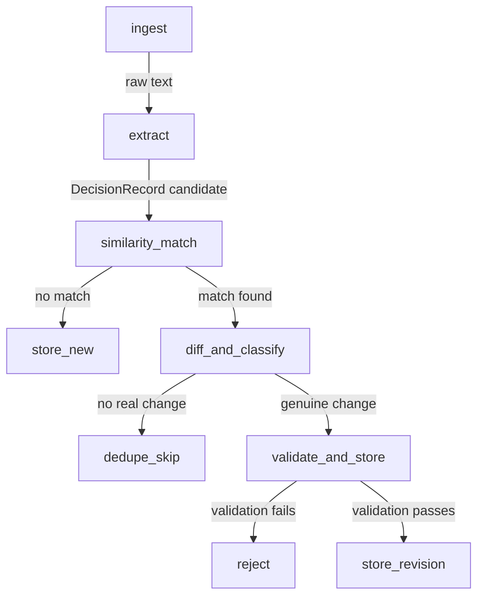

# Decision Provenance Agent — Implementation Plan

## Goal
Build a marketplace-ready **Decision Provenance Agent** that tracks *why* decisions changed over time — not just current state — using Gemini 2.5 Flash as the LLM backbone. Target platform: [Central AI](https://centralai.app/).

---

## Key Adaptations from README/STARTER_KIT

The original docs reference Claude + Anthropic SDK. We're adapting:

| Original | Our Build |
|---|---|
| `langchain-anthropic` (Claude) | `langchain-google-genai` (Gemini 2.5 Flash) |
| Qdrant (requires Docker) | **ChromaDB** (zero-setup, in-process, pip-installable — easy for marketplace) |
| `sentence-transformers` (local) | Gemini's embedding model (`models/text-embedding-004`) — one less dependency |
| `bge-small` embeddings (384d) | Gemini embedding (768d) |

> [!IMPORTANT]
> **Why ChromaDB over Qdrant?** Central AI runs agents in their hosted environment. ChromaDB is a pure Python pip dependency that works in-process — no Docker, no external service, no setup friction. This makes the agent easy to deploy, review, and run on the marketplace. When you scale later, swapping to Qdrant is a ~30 line change in `storage.py`.

---

## Open Questions

> [!IMPORTANT]
> 1. **Central AI submission format**: Do they require a specific agent manifest, Dockerfile, or entry point convention? I couldn't scrape their submission docs (the site is heavily JS-rendered). You may need to check their developer docs or submission flow manually. For now, we'll build a standard FastAPI + LangGraph agent that can be wrapped in whatever format they need.
> 2. **Pricing tier**: Central AI bills hourly. Have you decided on your hourly rate for this agent?

---

## Project Structure

```
decision_provenance_agent/
├── app/
│   ├── __init__.py
│   ├── main.py              # FastAPI entrypoint (ingest, query endpoints)
│   ├── models.py             # Pydantic: DecisionRecord + validators
│   ├── graph.py              # LangGraph pipeline (ingest → match → diff → store)
│   ├── storage.py            # SQLite (record chains) + ChromaDB (vectors)
│   ├── prompts.py            # Gemini prompt templates (extraction + diff)
│   └── config.py             # env vars, thresholds, model config
├── tests/
│   ├── __init__.py
│   ├── test_models.py        # Schema + validator tests
│   ├── test_storage.py       # Storage layer tests
│   └── test_pipeline.py      # End-to-end pipeline tests
├── demo/
│   └── demo_seed.py          # Seeds the Postgres example from README demo script
├── .env.example
├── requirements.txt
├── README.md                 # Marketplace-ready README
└── LICENSE
```

---

## Proposed Changes

### Component 1: Core Schema & Configuration

#### [NEW] [`app/__init__.py`](file:///e:/Ghost%20OS/projects/decision_provenance_agent/app/__init__.py)
Empty package init.

#### [NEW] [`app/models.py`](file:///e:/Ghost%20OS/projects/decision_provenance_agent/app/models.py)
- `ChangeTrigger` enum: `new_evidence`, `correction`, `constraint_change`
- `DecisionRecord` Pydantic model with all fields from README
- `@model_validator(mode="after")` enforcing: if `supersedes` is set, `change_trigger` must also be set
- `evidence` field with `min_length=1` — no claim without traceable evidence

#### [NEW] [`app/config.py`](file:///e:/Ghost%20OS/projects/decision_provenance_agent/app/config.py)
- Load `.env` via `python-dotenv`
- Config class with: `GOOGLE_API_KEY`, `SIMILARITY_THRESHOLD` (default 0.78), `DB_PATH`, `CHROMA_PERSIST_DIR`, `GEMINI_MODEL` (default `gemini-2.5-flash`)

#### [NEW] [`.env.example`](file:///e:/Ghost%20OS/projects/decision_provenance_agent/.env.example)
```
GOOGLE_API_KEY=your-key-here
SIMILARITY_THRESHOLD=0.78
DB_PATH=./decisions.db
CHROMA_PERSIST_DIR=./chroma_data
GEMINI_MODEL=gemini-2.5-flash
```

#### [NEW] [`requirements.txt`](file:///e:/Ghost%20OS/projects/decision_provenance_agent/requirements.txt)
```
fastapi
uvicorn[standard]
langgraph
langchain-google-genai
chromadb
pydantic>=2.0
python-dotenv
```

---

### Component 2: Storage Layer

#### [NEW] [`app/storage.py`](file:///e:/Ghost%20OS/projects/decision_provenance_agent/app/storage.py)
Two sub-systems:

**SQLite** (record chains & metadata):
- `init_db()` — creates the `decision_records` table with index on `topic_key`
- `insert_record(record: DecisionRecord)` — stores a record
- `get_current_record(topic_key: str)` — walks chain to find the newest non-superseded record
- `get_provenance_chain(topic_key: str)` — returns full chain in chronological order with change triggers
- `get_record_by_id(id: str)` — single record lookup
- `list_topics()` — returns all unique topic_keys

**ChromaDB** (vector similarity):
- `init_chroma()` — creates/loads a persistent collection
- `add_embedding(record_id, topic_key, claim)` — embed and store `topic_key + " " + claim`
- `find_similar(topic_key, claim, threshold)` — returns matching record IDs above threshold

Embedding uses `langchain-google-genai`'s `GoogleGenerativeAIEmbeddings(model="models/text-embedding-004")`.

---

### Component 3: LLM Prompts

#### [NEW] [`app/prompts.py`](file:///e:/Ghost%20OS/projects/decision_provenance_agent/app/prompts.py)
Two prompt templates, both enforcing JSON-only output:

1. **Extraction prompt** — raw text → `{topic_key, claim, reasoning, confidence, evidence}`
2. **Diff prompt** — old record + new input → `{changed: bool, change_trigger: str|null, diff_summary: str}`

Both call Gemini 2.5 Flash via `langchain-google-genai`'s `ChatGoogleGenerativeAI` with structured JSON output.

---

### Component 4: LangGraph Pipeline

#### [NEW] [`app/graph.py`](file:///e:/Ghost%20OS/projects/decision_provenance_agent/app/graph.py)



Graph nodes:
1. **`extract_node`** — calls extraction prompt, produces candidate record
2. **`match_node`** — queries ChromaDB for similar records
3. **`diff_node`** — if match found, calls diff prompt to classify change
4. **`validate_node`** — enforces validator rules (evidence required, change_trigger required for supersedes)
5. **`store_node`** — writes to SQLite + ChromaDB

State schema: `TypedDict` with `raw_input`, `candidate`, `matched_record`, `diff_result`, `final_record`, `status`

---

### Component 5: FastAPI Interface

#### [NEW] [`app/main.py`](file:///e:/Ghost%20OS/projects/decision_provenance_agent/app/main.py)

Three endpoints:

| Method | Path | Purpose |
|---|---|---|
| `POST` | `/ingest` | Accept raw text, run through LangGraph pipeline, return stored record |
| `GET` | `/query/{topic_key}?mode=current` | Return the latest non-superseded record for a topic |
| `GET` | `/query/{topic_key}?mode=provenance` | Return the full decision chain with change triggers |
| `GET` | `/topics` | List all tracked topics |
| `GET` | `/health` | Health check |

---

### Component 6: Demo & Tests

#### [NEW] [`demo/demo_seed.py`](file:///e:/Ghost%20OS/projects/decision_provenance_agent/demo/demo_seed.py)
Script that runs the exact demo from the README:
1. Ingest: "We're using Postgres for this service." (reasoning: simplicity, team familiarity)
2. Ingest: "We're using Postgres with read replicas." (reasoning: load testing showed bottleneck)
3. Query current state → shows record #2
4. Query provenance → shows both records + diff + trigger

#### [NEW] [`tests/test_models.py`](file:///e:/Ghost%20OS/projects/decision_provenance_agent/tests/test_models.py)
- Test validator rejects `supersedes` without `change_trigger`
- Test evidence `min_length=1` enforcement
- Test confidence bounds

#### [NEW] [`tests/test_storage.py`](file:///e:/Ghost%20OS/projects/decision_provenance_agent/tests/test_storage.py)
- Test SQLite CRUD
- Test provenance chain retrieval order

#### [NEW] [`tests/test_pipeline.py`](file:///e:/Ghost%20OS/projects/decision_provenance_agent/tests/test_pipeline.py)
- End-to-end: ingest → query current → ingest update → query provenance

---

## Build Order (8 Steps)

| Step | What | Depends On |
|---|---|---|
| 1 | `config.py` + `.env.example` + `requirements.txt` | — |
| 2 | `models.py` + `test_models.py` — schema + validators | Step 1 |
| 3 | `storage.py` (SQLite only) + `test_storage.py` | Step 2 |
| 4 | `storage.py` (add ChromaDB) — embeddings + similarity | Step 3 |
| 5 | `prompts.py` — extraction + diff prompts via Gemini | Step 1 |
| 6 | `graph.py` — wire everything into LangGraph | Steps 3-5 |
| 7 | `main.py` — FastAPI endpoints | Step 6 |
| 8 | `demo/demo_seed.py` + end-to-end test | Step 7 |

> [!TIP]
> We stop and demo after Step 8. No auth, no UI, no multi-tenant support for v1. A working core loop with one compelling demo beats a half-built feature-rich version — especially for marketplace review.

---

## Verification Plan

### Automated Tests
```bash
# Run all tests
python -m pytest tests/ -v

# Run just model validation tests
python -m pytest tests/test_models.py -v
```

### Manual Verification
1. Start the server: `uvicorn app.main:app --reload`
2. Run `demo/demo_seed.py` — verify the Postgres example produces a correct provenance chain
3. Hit `/query/database_choice?mode=provenance` — verify full chain with triggers
4. Hit `/query/database_choice?mode=current` — verify latest record only

### Marketplace Readiness Check
- [ ] Agent runs with only `pip install -r requirements.txt` + a Gemini API key
- [ ] No Docker, no external services needed
- [ ] Demo produces a compelling "before/after" showing what flat memory can't do
- [ ] README clearly explains the value prop for Central AI reviewers
